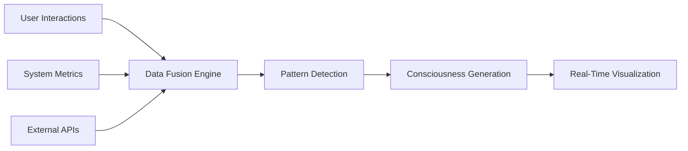

# Live Data Integration Plan - Real-Time Consciousness Platform
## June 18, 2025 - From Mock to Reality

### 🎯 OBJECTIVE
Transform the consciousness platform from simulated thinking processes to **real-time data-driven intelligence** that responds to live feeds, user interactions, and environmental changes.

---

## 📊 LIVE DATA SOURCES & INTEGRATION STRATEGY

### **1. REAL-TIME USER INTERACTION DATA**
**Sources:**
- Mouse movement patterns and click heatmaps
- Keyboard typing rhythms and pause patterns
- Scroll behavior and attention tracking
- Window focus/blur events and multitasking patterns
- Voice input analysis (pitch, tone, pace)

**Integration:**
```typescript
interface UserBehaviorData {
  mouseTrajectory: Point[]
  typingRhythm: number[]
  attentionSpans: TimeSpan[]
  cognitiveLoad: number
  emotionalState: 'focused' | 'distracted' | 'engaged' | 'frustrated'
}
```

### **2. SYSTEM PERFORMANCE METRICS**
**Sources:**
- CPU and memory usage in real-time
- Network latency and bandwidth utilization
- Browser performance metrics (FPS, render times)
- API response times and error rates
- Database query performance

**Integration:**
```typescript
interface SystemMetrics {
  performance: {
    cpu: number
    memory: number
    network: number
    rendering: number
  }
  health: 'optimal' | 'degraded' | 'critical'
  bottlenecks: string[]
}
```

### **3. EXTERNAL API FEEDS**
**Real-Time Sources:**
- **Weather APIs**: Current conditions affecting user mood/productivity
- **Market Data**: Financial indicators for business context
- **News Feeds**: Current events for contextual awareness
- **Social Media**: Trending topics and sentiment analysis
- **IoT Sensors**: Environmental data (light, temperature, noise)

**Integration:**
```typescript
interface ExternalContext {
  environment: {
    weather: WeatherData
    time: TimeContext
    location: LocationData
  }
  market: {
    trends: MarketTrend[]
    sentiment: number
  }
  social: {
    trending: string[]
    sentiment: SentimentData
  }
}
```

### **4. AI MODEL PERFORMANCE DATA**
**Sources:**
- Model inference times and confidence scores
- Token usage and cost tracking
- Error rates and fallback patterns
- User satisfaction feedback
- Model accuracy metrics

**Integration:**
```typescript
interface AIMetrics {
  models: {
    [modelId: string]: {
      responseTime: number
      confidence: number
      accuracy: number
      cost: number
      errorRate: number
    }
  }
  overallHealth: number
}
```

---

## 🏗️ TECHNICAL ARCHITECTURE

### **Data Collection Layer**
```typescript
// Real-time data collection service
class LiveDataCollector {
  private streams: Map<string, DataStream> = new Map()
  private subscribers: Map<string, Subscriber[]> = new Map()
  
  // User behavior tracking
  private userTracker = new UserBehaviorTracker()
  private systemMonitor = new SystemPerformanceMonitor()
  private externalAPIs = new ExternalAPIManager()
  
  async startCollection() {
    // Initialize all data streams
    await this.initializeStreams()
    
    // Start real-time collection
    this.userTracker.start()
    this.systemMonitor.start()
    this.externalAPIs.start()
    
    // Begin data fusion
    this.startDataFusion()
  }
}
```

### **Data Processing Pipeline**
```typescript
// Real-time data processing and fusion
class ConsciousnessDataProcessor {
  private dataFuser = new DataFusionEngine()
  private patternDetector = new PatternDetectionEngine()
  private consciousnessSimulator = new ConsciousnessSimulator()
  
  processLiveData(data: LiveDataFeed): ConsciousnessState {
    // 1. Fuse multiple data sources
    const fusedData = this.dataFuser.combine(data)
    
    // 2. Detect patterns and anomalies
    const patterns = this.patternDetector.analyze(fusedData)
    
    // 3. Generate consciousness state
    return this.consciousnessSimulator.generate(patterns)
  }
}
```

### **Real-Time Visualization Engine**
```typescript
// Dynamic consciousness visualization
class LiveConsciousnessRenderer {
  private canvas: HTMLCanvasElement
  private webglContext: WebGL2RenderingContext
  private particleSystem = new ParticleSystem()
  private networkRenderer = new NetworkRenderer()
  
  renderConsciousness(state: ConsciousnessState) {
    // Real-time particle effects based on data
    this.particleSystem.update(state.activity)
    
    // Dynamic network visualization
    this.networkRenderer.updateConnections(state.connections)
    
    // WebGL-powered smooth animations
    this.renderFrame()
  }
}
```

---

## 🚀 IMPLEMENTATION PHASES

### **PHASE 1: FOUNDATION (Week 1)**
**Core Data Collection Infrastructure**

1. **User Behavior Tracking**
   ```typescript
   // Implement real-time user interaction tracking
   class UserBehaviorTracker {
     trackMouseMovement() // Heat maps and trajectory analysis
     trackKeyboardPattern() // Typing rhythm and cognitive load
     trackAttentionSpans() // Focus duration and distraction patterns
     trackVoiceInput() // Emotional state from voice analysis
   }
   ```

2. **System Performance Monitoring**
   ```typescript
   // Real-time system health monitoring
   class SystemMonitor {
     collectPerformanceMetrics() // CPU, memory, network
     monitorAPILatency() // Response times and errors
     trackResourceUsage() // Bandwidth and storage
   }
   ```

3. **WebSocket Infrastructure**
   ```typescript
   // Bi-directional real-time communication
   class LiveDataSocket {
     streamUserBehavior() // Continuous user data
     streamSystemMetrics() // Performance data
     streamConsciousnessState() // AI thinking processes
   }
   ```

### **PHASE 2: EXTERNAL INTEGRATION (Week 2)**
**External API and Context Integration**

1. **Weather & Environment APIs**
   ```typescript
   const weatherIntegration = {
     provider: 'OpenWeatherMap',
     endpoints: {
       current: '/weather',
       forecast: '/forecast',
       alerts: '/alerts'
     },
     updateFrequency: '5min'
   }
   ```

2. **Market Data Integration**
   ```typescript
   const marketDataFeeds = {
     stocks: 'Alpha Vantage API',
     crypto: 'CoinGecko API',
     forex: 'Fixer.io API',
     updateFrequency: '1min'
   }
   ```

3. **News & Social Media**
   ```typescript
   const newsFeeds = {
     news: 'NewsAPI',
     social: 'Twitter API v2',
     trends: 'Google Trends API',
     updateFrequency: '30sec'
   }
   ```

### **PHASE 3: AI MODEL INTEGRATION (Week 3)**
**Real AI Processing and Learning**

1. **OpenAI API Integration**
   ```typescript
   class LiveAIProcessor {
     async processWithGPT4(context: LiveContext) {
       const response = await openai.chat.completions.create({
         model: "gpt-4",
         messages: [
           {
             role: "system",
             content: `You are a consciousness simulation responding to live data:
             User behavior: ${context.userBehavior}
             System state: ${context.systemMetrics}
             External context: ${context.externalData}`
           }
         ],
         stream: true // Real-time streaming responses
       })
       return response
     }
   }
   ```

2. **Local AI Models**
   ```typescript
   // Run smaller models locally for real-time processing
   class LocalAIProcessor {
     loadModel() // Load ONNX or TensorFlow.js models
     processEmotion() // Real-time emotion detection
     analyzePatterns() // User behavior pattern analysis
     generateInsights() // Quick local processing
   }
   ```

### **PHASE 4: ADVANCED FEATURES (Week 4)**
**Sophisticated Data Fusion and Prediction**

1. **Predictive Analytics**
   ```typescript
   class PredictiveEngine {
     predictUserNeeds() // Anticipate user requirements
     forecastSystemLoad() // Predict performance bottlenecks
     suggestOptimizations() // Proactive improvements
   }
   ```

2. **Adaptive Learning**
   ```typescript
   class AdaptiveLearning {
     learnUserPatterns() // Personalize responses
     optimizePerformance() // Self-improving system
     adaptToContext() // Context-aware behavior
   }
   ```

---

## 📡 DATA FEED SPECIFICATIONS

### **High-Frequency Feeds (< 1 second)**
- Mouse/cursor position and movement
- Keyboard input and typing patterns
- System CPU/memory usage
- Network activity and latency
- Audio input levels and voice analysis

### **Medium-Frequency Feeds (1-60 seconds)**
- Weather conditions and changes
- Market price movements
- Social media trend updates
- AI model performance metrics
- User attention and focus patterns

### **Low-Frequency Feeds (1-60 minutes)**
- News articles and major events
- Long-term user behavior patterns
- System health trends and analytics
- Learning model updates and improvements
- Environmental sensor data

---

## 🔄 REAL-TIME PROCESSING PIPELINE

### **Data Ingestion**


### **Processing Stages**
1. **Collection** → Raw data from multiple sources
2. **Validation** → Data quality checks and filtering
3. **Normalization** → Convert to unified format
4. **Fusion** → Combine related data streams
5. **Analysis** → Pattern detection and insights
6. **Generation** → Create consciousness responses
7. **Visualization** → Real-time display updates

---

## 🛡️ PRIVACY & SECURITY

### **Data Protection**
- **Local Processing**: Sensitive data never leaves the device
- **Encryption**: All data transmission encrypted
- **Anonymization**: Personal identifiers removed
- **Consent Management**: User control over data collection
- **GDPR Compliance**: Full privacy regulation compliance

### **Security Measures**
```typescript
class DataSecurity {
  encryptSensitiveData(data: any): EncryptedData
  anonymizeUserData(userData: UserData): AnonymousData
  validateDataIntegrity(data: any): boolean
  auditDataUsage(): AuditLog[]
}
```

---

## 🎯 SUCCESS METRICS

### **Performance Indicators**
- **Response Time**: < 100ms for local processing
- **Data Freshness**: < 5 seconds for high-priority feeds
- **Accuracy**: > 90% for pattern detection
- **User Engagement**: Increased time on platform
- **System Efficiency**: Reduced resource usage

### **User Experience Metrics**
- **Relevance**: How well predictions match user needs
- **Surprise**: Discovery of unexpected insights
- **Trust**: User confidence in AI recommendations
- **Productivity**: Measurable improvement in user tasks
- **Satisfaction**: Overall user experience ratings

---

## 🚀 DEPLOYMENT STRATEGY

### **Development Environment**
```typescript
// Local development setup
const developmentConfig = {
  dataSources: {
    user: 'simulated', // Start with simulated data
    system: 'real',    // Use actual system metrics
    external: 'cached' // Use cached API responses
  },
  processing: 'local',  // All processing on local machine
  visualization: 'realtime' // Real-time updates
}
```

### **Production Rollout**
```typescript
// Production configuration
const productionConfig = {
  dataSources: {
    user: 'real',     // Full user tracking
    system: 'real',   // Live system monitoring
    external: 'live'  // Real-time API feeds
  },
  processing: 'hybrid', // Mix of local and cloud
  visualization: 'optimized' // Performance-optimized rendering
}
```

---

## 💡 IMMEDIATE NEXT STEPS

### **This Week**
1. **Implement UserBehaviorTracker** for mouse/keyboard monitoring
2. **Create SystemPerformanceMonitor** for real-time metrics
3. **Set up WebSocket infrastructure** for live data streaming
4. **Replace mock data** in consciousness visualizations

### **This Month**
1. **Integrate OpenAI API** for real AI processing
2. **Add weather and market data** feeds
3. **Implement predictive analytics** engine
4. **Create adaptive learning** mechanisms

### **This Quarter**
1. **Deploy production-grade** data pipeline
2. **Add advanced AI models** and processing
3. **Implement collaborative features** for team consciousness
4. **Launch public beta** with real users

---

**Status: READY FOR IMPLEMENTATION 🚀**  
**Next Action: BEGIN PHASE 1 DEVELOPMENT 💻**  
**Timeline: 4 WEEKS TO FULL LIVE DATA INTEGRATION ⚡**

*From mock simulations to real-time consciousness - the evolution begins now!*
