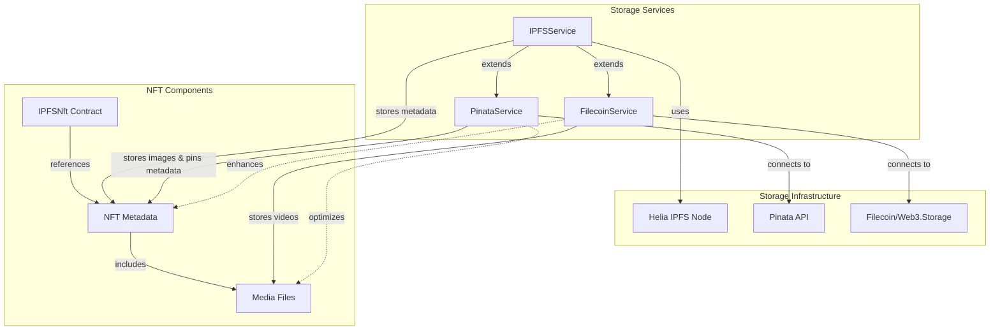
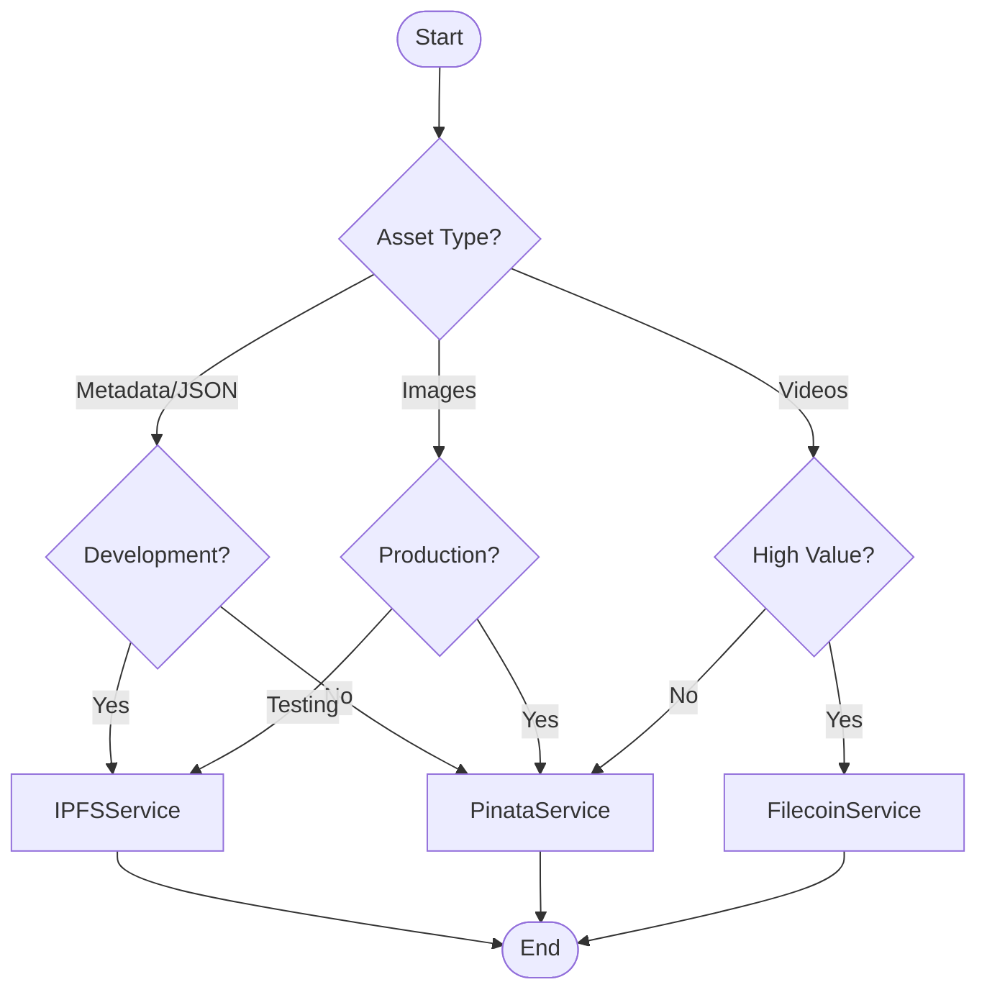
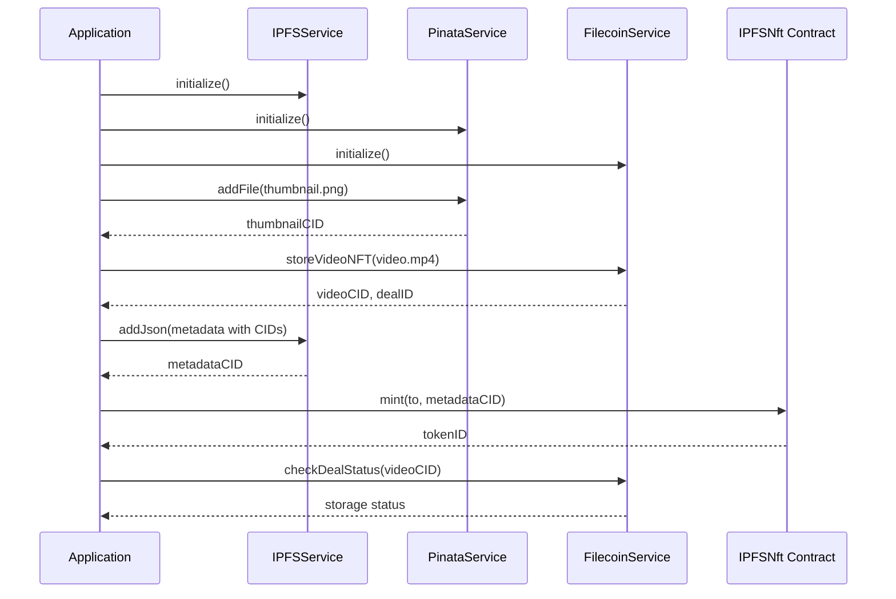

# Helia-Blockchain Architecture Diagram

## Storage Services Architecture

```mermaid
graph TD
    subgraph "Storage Services"
        A[IPFSService] -->|extends| B[PinataService]
        A -->|extends| C[FilecoinService]
    end

    subgraph "Storage Infrastructure"
        D[Helia IPFS Node]
        E[Pinata API]
        F[Filecoin/Web3.Storage]
        A -->|uses| D
        B -->|connects to| E
        C -->|connects to| F
    end

    subgraph "NFT Components"
        G[IPFSNft Contract]
        H[NFT Metadata]
        I[Media Files]
        G -->|references| H
        H -->|includes| I
    end

    A -->|stores metadata| H
    B -->|stores images & pins metadata| H
    C -->|stores videos| I
    B -.->|optimizes| I
    C -.->|enhances| H
```

## Storage Service Selection Flow

```mermaid
flowchart TD
    START([Start]) --> A{Asset Type?}
    A -->|Metadata/JSON| B{Development?}
    A -->|Images| C{Production?}
    A -->|Videos| D{High Value?}
    
    B -->|Yes| E[IPFSService]
    B -->|No| F[PinataService]
    
    C -->|Testing| E
    C -->|Yes| F
    
    D -->|Yes| G[FilecoinService]
    D -->|No| F
    
    E --> END([End])
    F --> END
    G --> END
```

## Integration Workflow

```mermaid
sequenceDiagram
    participant App as Application
    participant IPFS as IPFSService
    participant Pinata as PinataService
    participant Filecoin as FilecoinService
    participant Contract as IPFSNft Contract
    
    App->>IPFS: initialize()
    App->>Pinata: initialize()
    App->>Filecoin: initialize()
    
    App->>Pinata: addFile(thumbnail.png)
    Pinata-->>App: thumbnailCID
    
    App->>Filecoin: storeVideoNFT(video.mp4)
    Filecoin-->>App: videoCID, dealID
    
    App->>IPFS: addJson(metadata with CIDs)
    IPFS-->>App: metadataCID
    
    App->>Contract: mint(to, metadataCID)
    Contract-->>App: tokenID
    
    App->>Filecoin: checkDealStatus(videoCID)
    Filecoin-->>App: storage status
```
